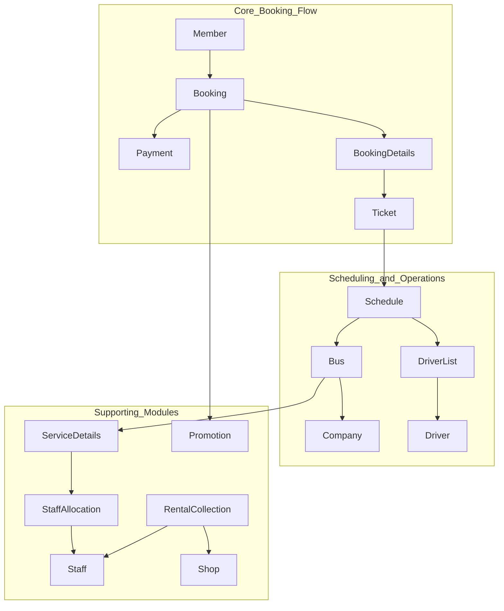

# Bus Station Management System

ORACLE 11g SQL Plus
username: dbmanagement
password: abcxyz


This project is a comprehensive relational database system designed to manage the core operations of a bus station. Built on Oracle 11g, it utilizes PL/SQL to implement complex business logic, enforce data integrity, and generate insightful reports. The system handles everything from member registration and ticket bookings to schedule management and vehicle maintenance.

## System Architecture Overview

The database is designed around a set of normalized tables that manage distinct business entities. The core workflow revolves around members making bookings for specific bus schedules.



## Business Rules & Assumptions

### Business Rules

1.  **Member & Bookings:** A member can make one or many bookings, but each booking must be associated with a single member. (One-to-Many: `Member` to `Booking`).
2.  **Booking & Tickets:** A single booking can contain one or many tickets, but each ticket belongs to exactly one booking. (One-to-Many, implemented via `BookingDetails`).
3.  **Schedule & Drivers:** A scheduled trip can be operated by one or more drivers, and a driver can be assigned to many different schedules over time. (Many-to-Many: `Schedule` to `Driver`).
4.  **Bus Ownership:** Each bus must be owned and operated by one, and only one, company. (One-to-Many: `Company` to `Bus`).
5.  **Ticket Cancellation:** Members can cancel a booked ticket and receive a 70% refund, but only if the cancellation is made more than 48 hours (2 days) prior to the scheduled departure time.
6.  **Ticket Extension:** Members can extend a ticket's validity, but this must be done more than 48 hours prior to departure and incurs a fixed administrative fee of RM 5.00 on top of the current ticket price.
7.  **Company Cancellation:** A full (100%) refund must be issued to the member if a bus schedule is cancelled by the operating bus company.
8.  **Unique Ticket Actions:** A ticket can be either refunded or extended, but not both. Each action is final and can only occur once per ticket. (One-to-One: `Ticket` to `Refund`; `Ticket` to `Extension`).
9.  **Membership Registration:** A new member must pay a one-time, non-refundable registration fee of RM 10.00.
10. **Service Records:** Every maintenance, repair, or washing service performed on a bus must be recorded as a unique service transaction.

### Assumptions

1.  **Ticket Pricing Model:** The final price of a ticket is calculated based on the `base_price` defined in the `Schedule` table. This price may be reduced if a valid `Promotion` is applied during the booking process.
2.  **Payment Processing:** The system records the details of a payment transaction (method, amount, date), but it is assumed that the actual financial processing is handled by a secure, external payment gateway.
3.  **Data Currency:** It is assumed that administrative staff are responsible for keeping core information, such as driver license details, bus plate numbers, and shop location codes, accurate and up-to-date.
4.  **Scope of Rentals:** The `RentalCollection` module is assumed to manage the collection of rental fees from tenants of commercial spaces (e.g., food stalls, shops) located within the bus station premises.
5.  **System Users:** The primary users of the administrative functions are internal staff members. Members interact with the system primarily for booking, cancellation, and extension purposes.

## Project Structure

The project is organized into a series of ordered SQL scripts. They are designed to be run sequentially to build, populate, and configure the database.

-   `01_create_tables.sql`: Contains the Data Definition Language (DDL) to create all tables, sequences, and constraints.
-   `02_populate_data.sql`: Contains the Data Manipulation Language (DML) to insert sample data into the tables.
-   `03_queries_and_views.sql`: Includes advanced queries and `VIEW` definitions for data analysis and simplifying access.
-   `04_stored_procedures.sql`: Implements core business logic through PL/SQL stored procedures (e.g., booking a ticket, cancelling a ticket).
-   `05_triggers.sql`: Defines database triggers to enforce complex business rules and automate actions.
-   `06_reports.sql`: Contains procedures designed to generate formatted reports using cursors.
-   `07_extra_features.sql`: Implements additional performance and usability features like indexes.

## Setup and Execution

To create and set up the database, execute the SQL scripts in a client connected to your Oracle 11g instance (like SQL*Plus or SQL Developer) in the following order:

1.  `01_create_tables.sql`
2.  `02_populate_data.sql`
3.  `03_queries_and_views.sql`
4.  `04_stored_procedures.sql`
5.  `05_triggers.sql`
6.  `06_reports.sql`
7.  `07_extra_features.sql`

**Note:** To view the output from the reporting procedures, you may need to enable server output in your SQL client:
```sql
SET SERVEROUTPUT ON;
``` 

## Technology Stack

-   **Database:** Oracle 11g
-   **Language:** SQL, PL/SQL