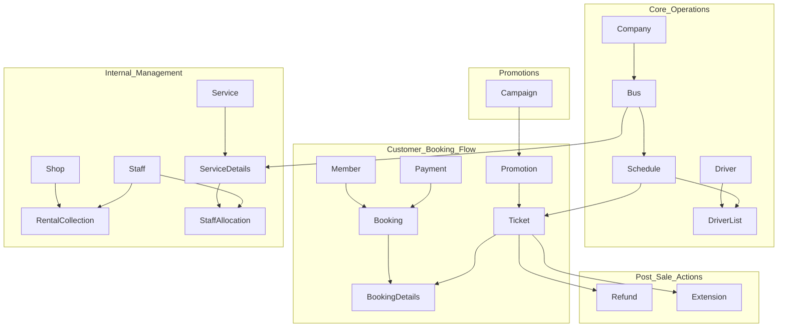

# Bus Station Management System

## 1. Project Overview

This project is a comprehensive implementation of a relational database system for a Bus Station Management System, designed as part of a university database curriculum. The system is built on **Oracle 11g** and leverages **SQL** and **PL/SQL** to model, manage, and enforce complex business rules.

The core objective is to create a robust, reliable, and scalable database foundation that handles all primary operations of a modern bus terminal, from customer-facing activities like ticket booking and promotions to internal operations like staff, fleet, and facilities management. The design prioritizes data integrity, normalization (3rd Normal Form), and clear separation of concerns.

---

## 2. Core Modules & Features

The system is designed to support the following mandatory business functionalities:

*   **Member Management**: Handles member registration, including a one-time registration fee.
*   **Online Booking System**: Allows members to search for schedules and purchase/book tickets online.
*   **Ticket Lifecycle Management**:
    *   **Cancellation**: Allows cancellation of a ticket up to 2 days in advance with a 70% refund.
    *   **Extension**: Allows extension of a ticket up to 2 days in advance with a nominal fee.
    *   **Full Refund**: Manages full refunds for bus schedules cancelled by the company.
*   **Operational Management**: Provides tools to manage:
    *   Staff (counter staff, cleaners, etc.)
    *   Shops and Rentals (food court, shop lots)
    *   Bus Fleet and Companies
    *   Drivers and Assignments
    *   Schedules and Platform Allocations
*   **Bus Maintenance**: Tracks services performed on buses, such as maintenance, repairs, and washing.
*   **Advanced Search**: Enables users to query bus schedules using multiple criteria (e.g., destination, price, time, company).
*   **Promotions Engine**: Manages marketing campaigns and applies various promotional discounts to tickets.

---

## 3. Database Schema

The database schema is the architectural blueprint of the system. It is designed in 3rd Normal Form to reduce data redundancy and improve data integrity. All relationships are explicitly enforced using primary and foreign key constraints.

The diagram below illustrates the high-level relationships between the core entities of the system.



---

## 4. Technology Stack

*   **Database**: Oracle Database 11g
*   **Language**: SQL, PL/SQL

---

## 5. Project Structure

The project files are organized into a logical directory structure to separate concerns and improve maintainability.

```
.
├── DDL/
│   ├── 01_create_sequences.sql
│   └── 02_create_tables.sql
├── DML/
│   └── populate_data.sql
├── PLSQL/
│   ├── procedures/
│   ├── triggers/
│   ├── views/
│   └── reports/
├── QUERIES/
│   ├── operational_queries.sql
│   └── analytical_queries.sql
└── README.md
```

*   **DDL/**: Contains Data Definition Language scripts for creating the database schema.
*   **DML/**: Contains Data Manipulation Language scripts for populating the database with sample records.
*   **PLSQL/**: Contains all PL/SQL code, organized by object type (procedures, triggers, views, report generation logic).
*   **QUERIES/**: Contains SQL queries designed to extract relevant information for decision-making.

---

## 6. Setup and Execution

To create and populate the database, execute the scripts in the following sequence using an Oracle SQL client (like SQL*Plus or SQL Developer):

1.  **Create Schema Objects**: Run the DDL scripts to build the database structure.
    ```bash
    sqlplus username/password@oracle_sid @DDL/01_create_sequences.sql
    sqlplus username/password@oracle_sid @DDL/02_create_tables.sql
    ```

2.  **Populate Data**: Run the DML script to insert the sample data.
    ```bash
    sqlplus username/password@oracle_sid @DML/populate_data.sql
    ```

3.  **Compile PL/SQL Code**: Compile all procedures, triggers, and views. It is recommended to compile views first, followed by procedures, and finally triggers.
    ```bash
    # Example for compiling a procedure
    sqlplus username/password@oracle_sid @PLSQL/procedures/your_procedure_name.sql
    ```

---

## 7. Author

*   **[Your Name]** - [Your Student ID]
